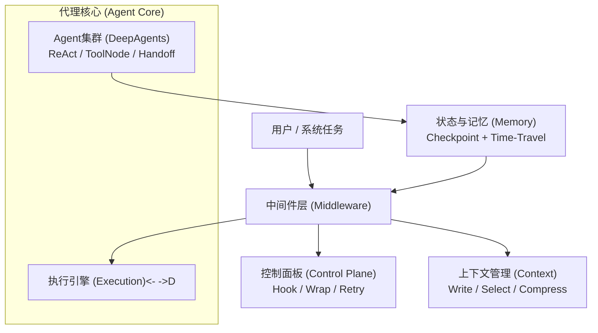

# 第一章：可控性 vs. 代理性：企业级Agent的“灵魂双螺旋”

欢迎来到企业级智能体（Agent）的世界。

在过去的几年里，我们见证了大型语言模型（LLM）的惊人崛起。它们强大的自然语言理解和生成能力，让我们得以一窥通用人工智能（AGI）的曙光。然而，当我们将这些强大的模型从实验室的聊天框，迁移到需要高可靠性、高安全性和高可预测性的企业生产环境时，一个深刻的、根本性的矛盾便浮现出来：**我们既希望Agent拥有强大的自主性，像一个聪明的员工一样主动完成任务；又恐惧于这种自主性可能带来的失控，像一个无法管理的“黑盒”一样引发灾难。**

这个矛盾，正是本书要解决的核心问题。它关乎两个核心概念：**代理性（Agenticness）**与**可控性（Controllability）**。

---

## 1.1 代理性（Agenticness）：让AI从“应答”走向“行动”

传统的软件遵循着精确的、由人编写的指令运行。而一个具备**代理性**的系统，则拥有了某种程度的“自由意志”。

> **代理性（Agenticness）** 指的是一个系统能够基于其目标和对环境的感知，自主地进行**规划（Planning）**、**决策（Decision-making）**和**执行（Execution）**的能力。

简单来说，一个只具备问答能力的LLM，你问它“如何创建一个用户服务？”，它会给你一段代码。而一个具备代理性的Agent，你对它说“为我们的项目创建一个用户服务”，它会自己去分析项目结构、创建文件、编写代码、添加测试，甚至在遇到问题时自我修正。

代理性的核心，源于一个被称为**ReAct (Reason + Act)**的循环，这个概念由Google在2022年提出（[参见论文：ReAct: Synergizing Reasoning and Acting in Language Models](https://arxiv.org/abs/2210.03629)）。

-   **思考 (Reason)**：Agent根据当前目标和上下文，进行逻辑推理，形成下一步的行动计划。
-   **行动 (Act)**：Agent执行计划，这个行动可以是调用一个工具（如代码编辑器、API）、查询数据库，或者向用户提问。
-   **观察 (Observe)**：Agent观察行动带来的结果（如代码运行的报错信息、API的返回数据），并将这个新的观察结果作为下一步“思考”的输入。

这个“思考-行动-观察”的循环，赋予了Agent动态适应环境、处理复杂任务的能力。它不再是一个被动的“应答机”，而是一个主动的“任务执行者”。

然而，正是这种强大的自主性，带来了企业环境中令人不安的另一面。

## 1.2 可控性（Controllability）：为Agent戴上“缰绳”

如果说代理性是Agent的“油门”，那么**可控性**就是它的“刹车”和“方向盘”。在一个追求100%稳定和安全的生产环境中，一个完全自主、行为不可预测的“黑盒”是不可接受的。

> **可控性（Controllability）** 指的是我们能够对一个Agent的行为、状态和决策过程进行**监控（Monitoring）**、**回放（Replaying）**、**干预（Intervening）**和**审计（Auditing）**的能力。

让我们将一个Agent想象成一位新入职的、非常有才华但缺乏经验的程序员。

-   **监控**：你需要能实时看到他的工作状态，他正在读哪个文件？他打算修改哪段代码？他遇到了什么问题？
-   **回放**：当他引入一个Bug时，你需要能完整复现他从接到任务到提交代码的全过程，以便定位问题根源。
-   **干预**：当他打算执行一个危险操作（例如 `rm -rf /`）时，你需要有一个机制能立即阻止他，并告诉他“这个操作是禁止的”。
-   **审计**：对于金融、法务等高合规行业，这位程序员的每一次操作都必须被记录在案，形成不可篡改的日志，以备审查。

缺乏可控性的Agent，就像一个在代码库里蒙眼狂奔的实习生，其潜在的破坏力远大于其创造力。因此，在企业级应用中，**可控性并非一个可选项，而是一个必需品**。

## 1.3 架构融合模型：本书的“系统总图”

那么，我们如何才能构建一个既拥有强大“代理性”，又具备严格“可控性”的系统呢？这需要一个精巧的架构设计，将二者完美地融合在一起。

本书后续的所有章节，都将围绕下面这张核心架构图展开。现在，你只需要对它有一个初步的印象，理解各个组件的宏观职责。

**核心流程说明:**

1.  **任务入口**：一切始于一个来自**用户或外部系统的任务**（节点A）。
2.  **中间件拦截**：任务首先进入**中间件层**（节点B），这里是实现全局策略的地方，如日志记录、身份验证、成本控制等。
3.  **决策与分发**：中间件将任务分发给三大核心组件：
    -   **控制面板**（节点C1）：负责定义Agent的行为规则，如重试、降级等。
    -   **上下文管理**（节点C2）：负责为Agent准备执行任务所需的信息，不多也不少。
    -   **代理核心**（节点C3/D）：这是**代理性**的体现。**执行引擎**和**Agent集群**在这里进行思考（ReAct）、选择工具（ToolNode）、并执行任务。
4.  **状态持久化**：在Agent执行的每一步，它的完整状态都会被**状态与记忆模块**（节点E）通过**Checkpoint**机制记录下来。
5.  **状态反馈**：持久化的状态信息会反馈回中间件层，用于监控、决策，并为**Time-Travel（时间旅行）**提供数据基础，从而实现**可控性**。

这个架构的核心思想在于，它通过**中间件层**和**状态与记忆模块**，像一个“安全带”一样，将拥有强大自主能力的**代理核心**牢牢地包裹起来。代理核心可以自由地思考和行动，但它的每一次呼吸、每一次心跳，都在我们的观测和掌控之下。

## 1.4 一句话总结

> **代理性是让智能体“自己动”，可控性是确保它“不越轨”。**

本书的目标，就是教会你如何构建一个系统，让Agent在拥有翅膀的同时，也被一根名为“可控”的线牵引着，既能翱翔万里，又不致迷失方向。

---

## 1.5 本章小结

-   本章定义了本书最重要的两个核心概念：**代理性**与**可控性**。
-   **代理性**通过**ReAct循环**赋予Agent自主规划和行动的能力，是其价值的来源。
-   **可控性**通过**监控、回放、干预、审计**四大手段确保Agent的行为符合预期，是其在企业环境中落地的前提。
-   我们提出了一个融合二者的**核心架构模型**，后续所有技术和实践都将基于此模型展开。

在下一章，我们将开始动手实践，搭建开发环境，并构建我们的第一个、最简单的“Hello, World!”Agent，亲身体验它的行为模式。
