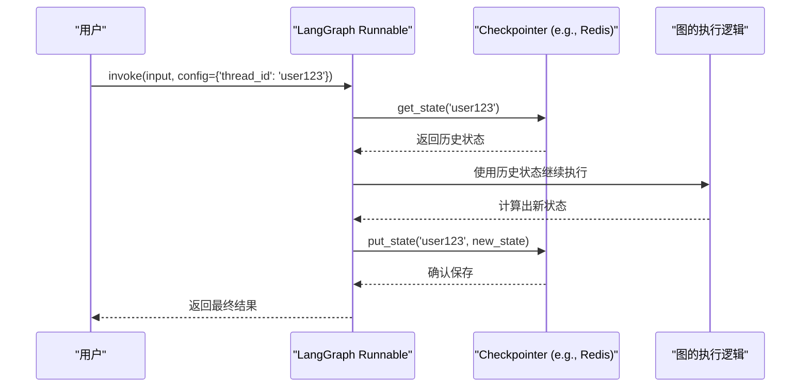

# 第四章：记忆与时间：实现Agent的“事务级时空穿梭”

在前几章中，我们构建的Agent虽然能够执行任务，但它的记忆是短暂的、易失的。每次运行都是一次全新的开始，程序结束，所有上下文便烟消云散。这在真实世界的应用中是远远不够的。如果一个用户与Agent进行了多轮对话，我们希望Agent能记住之前的交流内容；如果Agent在执行一个长任务时意外崩溃，我们希望它能从中断的地方恢复，而不是从头再来。

本章，我们将探讨**可控性**中一个至关重要的维度：**记忆与时间**。我们将学习如何通过**Checkpoint（检查点）**机制，赋予Agent跨越时间的能力，实现真正意义上的**可回放、可分叉、可审计**的“事务级时空穿梭”。

---

## 4.1 Checkpoint机制：为Agent的状态“存档”

**Checkpoint（检查点）**是`LangGraph`中实现持久化记忆的核心机制。它的概念非常简单：

> **Checkpoint** 是在图（Graph）执行过程中的某一个时间点，对Agent的**完整状态（State）**拍摄的一张“快照”。这张快照包含了到那一刻为止的所有对话消息、内部变量、以及执行历史。

您可以将它类比为：
-   **视频游戏中的存档点**：你可以在任何时候“读档”，回到那个时间点的状态。
-   **数据库的事务日志（Transaction Log）**：记录了每一次状态变更，使得数据库可以在崩溃后恢复。
-   **Git的版本提交（Commit）**：每一个Commit都是代码库在特定时间点的一个完整快照。

`LangGraph`内置了一个可插拔的Checkpointer系统。当你为一个图配置了Checkpointer后，它的工作流程会变成下面这样：



**流程说明:**

1.  **调用**：用户在调用`Runnable`时，必须在`configurable`字典中提供一个`thread_id`。这个ID是这轮对话或这个任务的唯一标识符，相当于游戏存档的“档位名”。
2.  **读档**：`Runnable`在执行任何计算之前，会先拿着`thread_id`去问`Checkpointer`：“这个档位有没有历史记录？”
3.  **恢复状态**：`Checkpointer`返回该`thread_id`对应的最新状态快照。`Runnable`将这个状态加载到内存中。
4.  **执行**：图的逻辑（Agent节点、工具节点等）在恢复的状态之上继续执行，计算出新的状态。
5.  **存档**：`Runnable`将包含新步骤的新状态，连同`thread_id`一起，交给`Checkpointer`进行保存。
6.  **返回结果**：`Runnable`将最终结果返回给用户。

通过这个“读档 -> 执行 -> 存档”的循环，`LangGraph`确保了Agent的每一次执行都是**有状态的、可延续的**。

---

## 4.2 Time-Travel（时间旅行）：Checkpoint的应用场景

一旦我们拥有了按时间顺序保存的Checkpoint快照，我们就解锁了强大的“时间旅行”能力，这在企业级应用中具有无与伦比的价值。

-   **可回放与可复现（Replay & Reproducibility）**
    这是最直接、最重要的应用。当线上系统出现问题，例如Agent给出了一个错误的答案或执行了一个异常的操作，我们不再需要猜测。我们可以精确地拿到出问题那次对话的`thread_id`，从Checkpointer中调取它的所有历史快照，**100%复现**Agent当时的完整内部状态和决策过程。这对于**调试（Debugging）**来说是革命性的。

-   **可分叉（Forking）**
    想象一个`git branch`命令。我们可以从任意一个历史时间点的状态快照，创建一个新的`thread_id`分支。这意味着我们可以：
    -   **进行A/B测试**：在某个对话节点，用不同的提示或模型“分叉”出两个新的对话分支，观察哪个分支能更好地完成任务，而不会污染原始对话。
    -   **模拟与推演**：在金融策略或业务流程模拟中，可以从某个关键决策点分叉，推演不同选择可能带来的未来结果。

-   **可审计（Auditing）**
    在金融、医疗、法务等受到严格监管的行业，对AI的决策过程进行审计是合规的必要条件。Checkpointer中存储的、带有时间戳的状态历史，形成了一条**不可篡改的审计链**。我们可以随时回溯任何一次决策，查看Agent是基于哪些输入信息、通过哪些步骤，最终得出了某个结论或执行了某个操作。

---

## 4.3 实战Lab：为Agent配置Redis持久化记忆

现在，让我们动手为第二章的“天气Agent”装上持久化记忆。我们将使用**Redis**作为我们的Checkpointer后端。Redis是一个高性能的内存数据库，非常适合用作状态存储。

### 4.3.1 环境准备

1.  **更新Dockerfile**：我们需要为开发环境安装Redis客户端库。

    修改`.devcontainer/Dockerfile`，在`pip install`部分增加`redis`和`langchain-community`。

    ```dockerfile
    # .devcontainer/Dockerfile
    RUN pip install --no-cache-dir \
        langchain \
        langgraph \
        pydantic \
        "langchain_openai[openai]" \
        python-dotenv \
        redis \
        langchain-community
    ```
    修改后，请按下`F1`，选择`Dev Containers: Rebuild Container`来重建你的开发环境。

2.  **运行Redis**：我们需要一个Redis实例。最简单的方式是使用Docker。

    在你的项目根目录下，创建一个`docker-compose.yml`文件：

    ```yaml
    # docker-compose.yml
    version: '3.8'
    services:
      redis:
        image: "redis:alpine"
        ports:
          - "6379:6379"
    ```

    然后在终端中运行 `docker-compose up -d`，Docker就会在后台为你启动一个Redis服务。

### 4.3.2 编写代码

创建一个新文件 `chapter_04_memory_and_time.py`。

```python
import os
from typing import TypedDict, Annotated
from langchain_openai import ChatOpenAI
from langgraph.graph import StateGraph, END
from langgraph.checkpoint.redis import RedisSaver
from langchain_core.tools import tool
from langchain_core.messages import ToolMessage, HumanMessage, BaseMessage

# --- 所有工具、状态、节点和图的定义与第二章完全相同 --- #

@tool
def get_weather(city: str) -> str:
    """获取指定城市的天气。"""
    print(f"---> 工具被调用：获取 {city} 的天气")
    if city == "北京":
        return "北京今天晴，25摄氏度。"
    elif city == "上海":
        return "上海今天有小雨，20摄氏度。"
    else:
        return f"抱歉，我不知道 {city} 的天气。"

class AgentState(TypedDict):
    messages: Annotated[list, lambda x, y: x + y]

model = ChatOpenAI(temperature=0).bind_tools([get_weather])

def agent_node(state: AgentState): 
    return {"messages": [model.invoke(state["messages"])]}

def tool_node(state: AgentState):
    tool_calls = state["messages"][-1].tool_calls
    tool_messages = []
    for call in tool_calls:
        response = get_weather.invoke(call["args"])
        tool_messages.append(ToolMessage(content=str(response), tool_call_id=call["id"]))
    return {"messages": tool_messages}

def router(state: AgentState) -> str:
    if state["messages"][-1].tool_calls:
        return "tool_node"
    return "__end__"

graph = StateGraph(AgentState)
graph.add_node("agent", agent_node)
graph.add_node("tool_node", tool_node)
graph.set_entry_point("agent")
graph.add_conditional_edges("agent", router, {"tool_node": "tool_node", "__end__": END})
graph.add_edge("tool_node", "agent")

# --- 核心变更：配置Checkpointer --- #

# 1. 实例化RedisSaver
# conn_string指向我们通过docker-compose启动的Redis服务
checkpointer = RedisSaver.from_conn_string("redis://localhost:6379")

# 2. 在编译图时，传入checkpointer
# 这会返回一个带持久化记忆的Runnable
runnable_with_memory = graph.compile(checkpointer=checkpointer)

# --- 运行与演示 --- #

if __name__ == "__main__":
    # 定义一个唯一的会话ID，例如用户ID或会话ID
    # 这就是我们之前说的 thread_id
    session_id = "user_123"
    config = {"configurable": {"thread_id": session_id}}

    print("--- 第一次对话 ---")
    initial_input = {"messages": [HumanMessage(content="你好，我是小明")]}
    # 调用invoke，传入config
    result = runnable_with_memory.invoke(initial_input, config)
    print(f"AI: {result['messages'][-1].content}")

    print("\n--- 第二次对话（在同一个会话中） ---")
    # Agent应该记得我叫小明
    follow_up_input = {"messages": [HumanMessage(content="北京今天天气怎么样？顺便问下，我叫什么名字？")]}
    result = runnable_with_memory.invoke(follow_up_input, config)
    print(f"AI: {result['messages'][-1].content}")

    print("\n--- 查看历史状态 ---")
    # 我们可以随时从checkpointer中获取某个会话的完整状态历史
    conversation_history = checkpointer.get_state(config)
    print(f"会话 '{session_id}' 的历史状态数: {len(conversation_history.next)}")
    print("历史消息:")
    for message in conversation_history.get().get("messages", []):
        print(f"- {message.type}: {message.content}")
```

### 4.3.3 运行与解读

运行 `python chapter_04_memory_and_time.py`，你将看到：

```
--- 第一次对话 ---
AI: 你好，小明！有什么可以帮助你的吗？

--- 第二次对话（在同一个会话中） ---
---> 工具被调用：获取 北京 的天气
AI: 北京今天天气晴朗，气温为25摄氏度。你叫小明。

--- 查看历史状态 ---
会话 'user_123' 的历史状态数: 4
历史消息:
- human: 你好，我是小明
- ai: 你好，小明！有什么可以帮助你的吗？
- human: 北京今天天气怎么样？顺便问下，我叫什么名字？
- ai: ... (tool_calls) ...
- tool: 北京今天晴，25摄氏度。
- ai: 北京今天天气晴朗，气温为25摄氏度。你叫小明。
```

**解读**：

-   在第二次对话中，Agent不仅正确调用了天气工具，还准确地记住了用户的名字“小明”。这证明了**记忆是持久化的**。
-   我们通过`checkpointer.get_state(config)`成功地取回了`user_123`这个会话的完整历史状态，展示了**可审计性**。
-   如果程序在第二次对话后中断，你重新运行第二次对话，它依然能记住小明的名字，这证明了**可恢复性**。

---

## 4.4 `[新增]` 从短期记忆到长期知识

我们已经实现了Agent的“会话记忆”（短期记忆）。但Checkpoint的价值远不止于此。它为我们打通了从**短期记忆**到**长期知识**的桥梁。

一个保存在Redis中的Checkpoint，不仅仅是一段对话记录，它是一个包含了**（输入 -> 思考步骤 -> 行动 -> 结果）**的完整、结构化的**成功（或失败）案例**。

我们可以构建一个离线的处理流程，定期地：

1.  **扫描** Checkpoint数据库，提取出高质量的对话或任务执行记录。
2.  **清洗与泛化**：将具体的对话（“小明你好”）转化为一个更通用的经验（“当用户介绍自己时，我应该记住他的名字并在后续称呼他”）。
3.  **存入知识库**：将这些泛化的经验、成功的解决方案、或被人类纠正过的错误，存入一个专门用于RAG的向量数据库中。

这样，当一个新的Agent在未来遇到类似问题时，它就可以通过检索这个“元知识库”，学习“过去的自己”或其他Agent是如何解决问题的。这就实现了Agent的**反馈进化（Co-evolution with feedback）**。我们将在第十二章的实战项目中，亲手实现这一高级功能。

---

## 4.5 本章小结

-   本章我们深入了**Checkpoint机制**，它是实现Agent持久化记忆和时间旅行能力的核心。
-   我们阐述了基于Checkpoint的**时间旅行**三大应用：用于调试的**可回放**，用于测试和模拟的**可分叉**，以及用于合规的**可审计**。
-   通过一个使用**Redis**作为存储后端的实战Lab，我们为一个Agent配置了真正的持久化记忆，并验证了它能够在多轮对话中保持上下文。
-   我们探讨了如何将Checkpoint中的短期记忆，转化为可供Agent学习和进化的**长期知识**，为构建更智能的系统埋下了伏笔。

至此，我们的Agent不仅有了“眼睛”和“手”（可观测、可干预），还有了“大脑”中的海马体（记忆）。在下一章，我们将关注另一个关键问题：如何高效地管理Agent的“注意力”，即**上下文工程**。
